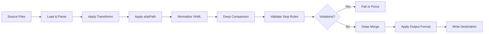
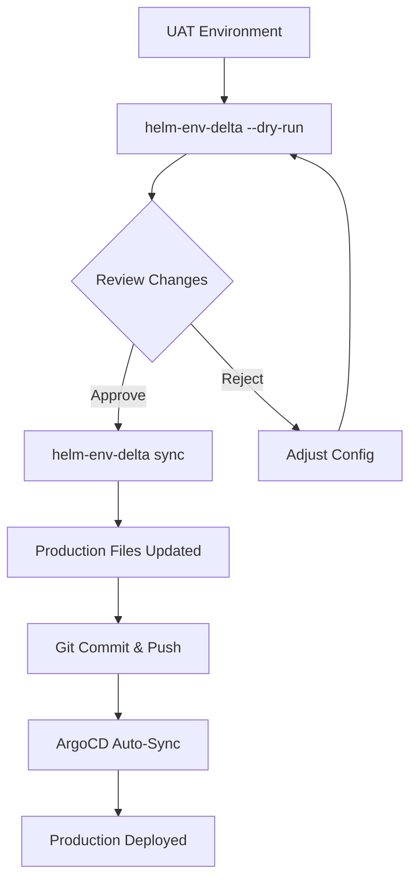
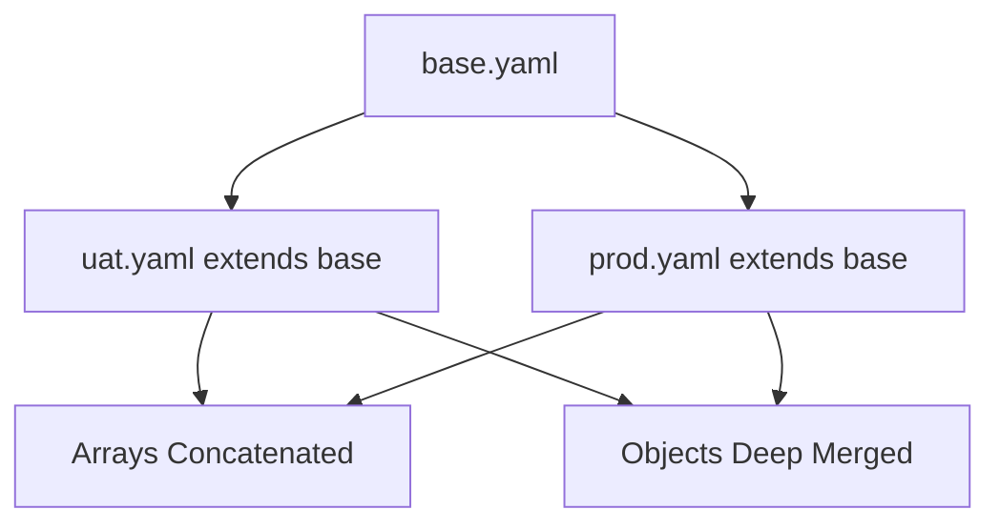

# HelmEnvDelta

[](https://www.npmjs.com/package/helm-env-delta)
[](https://opensource.org/licenses/ISC)
[](https://nodejs.org/)

**Environment-aware YAML delta and sync for GitOps workflows**

HelmEnvDelta (`helm-env-delta` or `hed`) is a CLI tool that safely synchronizes YAML configuration files across different environments (UAT → Production, Dev → Staging, etc.) while respecting environment-specific differences and enforcing validation rules.

---

## Table of Contents

- [Why HelmEnvDelta?](#why-helmenvdelta)
- [Adopting HelmEnvDelta in Existing GitOps Workflows](#adopting-helmenvdelta-in-existing-gitops-workflows)
- [Key Features](#key-features)
- [Installation](#installation)
- [Quick Start](#quick-start)
- [Use Cases](#use-cases)
- [Configuration Guide](#configuration-guide)
  - [Core Settings](#core-settings)
  - [Path Filtering (skipPath)](#path-filtering-skippath)
  - [Transformations (transforms)](#transformations-transforms)
  - [Stop Rules (stopRules)](#stop-rules-stoprules)
  - [Output Formatting (outputFormat)](#output-formatting-outputformat)
  - [Config Inheritance (extends)](#config-inheritance-extends)
- [CLI Usage](#cli-usage)
- [Complete Workflow Example](#complete-workflow-example)
- [Advanced Features](#advanced-features)
- [Advantages & Benefits](#advantages--benefits)
- [Real-World Configuration Examples](#real-world-configuration-examples)
- [Mermaid Diagrams](#mermaid-diagrams)
- [JSON Output Schema](#json-output-schema)
- [Migration Guide](#migration-guide)
- [Troubleshooting](#troubleshooting)
- [License & Links](#license--links)

---

## Why HelmEnvDelta?

Managing multiple Kubernetes/Helm environments in GitOps workflows presents several challenges:

**Problems:**

- **Manual Syncing is Error-Prone**: Copying changes between environments manually leads to mistakes, missed files, and inconsistencies
- **Environment-Specific Config Gets Lost**: Accidentally overwriting production-specific values (namespaces, secrets, scaling) causes deployment failures
- **Dangerous Changes Slip Through**: Major version upgrades, resource scaling beyond limits, or forbidden configurations can be deployed without review
- **YAML Formatting Becomes Inconsistent**: Different team members format YAML differently, making diffs noisy and reviews difficult
- **No Audit Trail**: Manual changes lack clear visibility into what changed and why

**HelmEnvDelta solves these problems by:**

- Automating synchronization while respecting environment differences
- Filtering out environment-specific paths that should never be synced
- Validating changes against safety rules before applying them
- Enforcing consistent YAML formatting across all environments
- Providing clear diff reports for audit and review

---

## Adopting HelmEnvDelta in Existing GitOps Workflows

If you're currently managing multiple environments manually in a GitOps workflow, HelmEnvDelta can be seamlessly integrated into your existing processes without disrupting your current setup.

### Before HelmEnvDelta: Manual Environment Sync

Many teams start with manual synchronization between environments:

1. **Manual File Copying**: Copy YAML files from UAT to Production manually
2. **Find & Replace in IDE**: Use editor search/replace to update environment-specific values
3. **Visual Diff Review**: Compare files side-by-side to ensure correctness
4. **Manual Git Commits**: Stage, commit, and push changes individually
5. **Hope for the Best**: Cross fingers that no environment-specific values were accidentally overwritten

This process works but is:

- **Time-consuming**: 15-30 minutes per sync depending on complexity
- **Error-prone**: Easy to miss files or make incorrect replacements
- **Inconsistent**: Different team members may format YAML differently
- **Unvalidated**: No automated checks for dangerous changes
- **Difficult to audit**: Hard to track what changed and why

### After HelmEnvDelta: Automated Sync

With HelmEnvDelta, the same workflow becomes:

```bash
# 1. Preview changes (5 seconds)
helm-env-delta --config config.yaml --dry-run --diff

# 2. Review in browser (visual confirmation)
helm-env-delta --config config.yaml --diff-html

# 3. Execute sync (2 seconds)
helm-env-delta --config config.yaml

# 4. Commit (standard git workflow)
git add . && git commit -m "Sync UAT to Prod" && git push
```

**Benefits:**

- **Faster**: Reduces sync time from 15-30 minutes to under 1 minute
- **Safer**: Stop rules prevent dangerous changes (version downgrades, scaling violations)
- **Consistent**: Enforces uniform YAML formatting across all files
- **Auditable**: Clear diff reports show exactly what changed
- **Repeatable**: Same configuration produces same results every time

### Migration Path: Start Small

You don't need to configure everything at once. Start with a minimal configuration and expand gradually:

**Phase 1: Basic Sync (Day 1)**

```yaml
source: './uat'
destination: './prod'
transforms:
  '**/*.yaml':
    content:
      - find: "-uat\\b"
        replace: '-prod'
```

Run `--dry-run --diff` to see what would change. This gives you confidence without modifying any files.

**Phase 2: Add Path Filtering (Week 1)**

```yaml
skipPath:
  '**/*.yaml':
    - 'metadata.namespace'
    - 'spec.replicas'
```

Identify fields that should never sync (namespaces, replica counts, resource limits) based on your environment differences.

**Phase 3: Add Safety Rules (Week 2)**

```yaml
stopRules:
  '**/*.yaml':
    - type: 'semverMajorUpgrade'
      path: 'image.tag'
    - type: 'numeric'
      path: 'replicaCount'
      min: 2
      max: 10
```

Add validation rules to catch dangerous changes before they reach production.

**Phase 4: Enforce Formatting (Week 3)**

```yaml
outputFormat:
  indent: 2
  keySeparator: true
  keyOrders:
    'apps/*.yaml':
      - 'apiVersion'
      - 'kind'
      - 'metadata'
      - 'spec'
```

Standardize YAML formatting to reduce diff noise in git.

### Gradual Adoption Strategy

1. **Start Read-Only**: Use `--dry-run` exclusively for the first week to build confidence
2. **Single Environment First**: Test with a non-critical environment pair (Dev → QA)
3. **Expand Configuration**: Add skipPath rules as you discover environment-specific fields
4. **Add Safety Nets**: Configure stop rules based on incidents you want to prevent
5. **Full Adoption**: Roll out to all environment pairs once validated

### Validating Your Configuration

Before fully adopting HelmEnvDelta, validate your configuration captures all environment differences:

```bash
# 1. Run dry-run with diff
helm-env-delta --config config.yaml --dry-run --diff

# 2. Review changes carefully
# Look for fields that should be skipped but aren't

# 3. Generate JSON report for detailed analysis
helm-env-delta --config config.yaml --dry-run --diff-json > report.json

# 4. Check specific fields
cat report.json | jq '.files.changed[].changes[] | select(.path | contains("namespace"))'
```

If you see fields changing that shouldn't (like production namespaces or replica counts), add them to `skipPath`.

### Coexistence with Manual Processes

HelmEnvDelta doesn't replace your entire workflow. It complements it:

- **Still use git**: HelmEnvDelta syncs files, you commit them
- **Still review PRs**: Generate HTML diffs for team review
- **Still use ArgoCD/Flux**: HelmEnvDelta updates files, your GitOps tool deploys them
- **Still have manual override**: Use `--force` when you need to bypass safety rules

### Real-World Adoption Example

A typical adoption timeline for a team managing 20+ microservices across 3 environments:

- **Week 1**: Install tool, create basic config, run dry-run on one service
- **Week 2**: Expand to 5 services, add skipPath rules, first real sync
- **Week 3**: Add stop rules after catching a version downgrade bug
- **Week 4**: Standardize YAML formatting across all environments
- **Month 2**: Full adoption for all services, integrated into CI/CD
- **Result**: Sync time reduced from 2 hours/week to 10 minutes/week, zero production incidents from sync errors

---

## Key Features



- **Intelligent YAML Diff & Sync**: Deep comparison of YAML content, ignoring formatting differences
  - Parses YAML structure instead of comparing text lines
  - Normal git diffs show changes when array items are reordered, but HelmEnvDelta's deep analysis recognizes that content is identical
  - Detects only meaningful changes (values, keys, structure) while ignoring whitespace, comments, and quote style differences
  - Results in cleaner, more accurate diffs that focus on what actually changed
- **Path Filtering (`skipPath`)**: Exclude environment-specific JSON paths from synchronization
- **Transformations (`transforms`)**: Regex-based find/replace for environment-specific values (DB URLs, service names)
- **Stop Rules (`stopRules`)**: Prevent dangerous changes (major version upgrades, scaling violations, forbidden patterns)
- **YAML Output Formatting**: Enforce consistent formatting (key ordering, indentation, value quoting, array sorting)
- **Config Inheritance (`extends`)**: Hierarchical configuration with base + environment-specific overrides
- **Multiple Reporting Formats**: Console diff, HTML report (visual side-by-side), JSON output (CI/CD integration)
- **Prune Mode**: Remove destination files not present in source
- **Dry-Run Preview**: Review all changes before applying them

---

## Installation

```bash
# Global installation
npm install -g helm-env-delta
```

**Prerequisites:**

- Node.js >= 22
- npm >= 9

---

## Quick Start

**1. Create a configuration file (`config.yaml`):**

```yaml
source: './uat'
destination: './prod'

# Skip environment-specific fields
skipPath:
  '**/*.yaml':
    - 'metadata.namespace'
    - 'spec.destination.namespace'

# Transform environment names
transforms:
  '**/*.yaml':
    content:
      - find: "-uat\\b"
        replace: '-prod'
```

**2. Run dry-run to preview changes:**

```bash
helm-env-delta --config config.yaml --dry-run --diff
```

**3. Execute the sync:**

```bash
helm-env-delta --config config.yaml
```

---

## Use Cases

### 1. Multi-Environment Promotion (UAT → Production)



Safely promote tested configurations from UAT to Production while preserving production-specific settings.

### 2. Helm Values Management

Synchronize Helm values files across environments while maintaining environment-specific overrides:

- Database connection strings
- Replica counts
- Resource limits
- Feature flags

### 3. Kubernetes Configuration

- **ArgoCD Applications**: Sync application manifests while preserving destination namespaces
- **Service Mesh Configs**: Istio, Linkerd configurations with environment-specific routing
- **Custom Resources**: CRDs with environment-specific parameters

### 4. Configuration Standardization

- Enforce consistent YAML formatting across all environments
- Apply naming convention transformations
- Standardize key ordering for better readability

### 5. CI/CD Integration

```bash
# Pipeline validation step
helm-env-delta --config config.yaml --dry-run --diff-json | jq '.summary'

# Check for violations
helm-env-delta --config config.yaml --diff-json | jq '.stopRuleViolations | length'
```

Integrate with CI/CD pipelines for pre-deployment validation and automated reporting.

---

## Configuration Guide

### Core Settings

```yaml
# Required for final config
source: './uat' # Source folder path
destination: './prod' # Destination folder path

# File selection (optional)
include: # Patterns to include (default: all files)
  - '**/*.yaml'
  - '**/README.md'
exclude: # Patterns to exclude (default: none)
  - '**/skip*.yaml'

# Pruning (optional)
prune: false # Remove dest files not in source (default: false)
```

**Notes:**

- `source` and `destination` are mandatory in the final config (can be omitted in base configs)
- `include`/`exclude` use glob patterns (`**` = recursive, `*` = wildcard)
- `prune: true` will delete files in destination that don't exist in source

---

### Path Filtering (skipPath)

Skip specific JSON paths during synchronization to preserve environment-specific values.

```yaml
skipPath:
  # Pattern: file glob
  'apps/*.yaml':
    - 'apiVersion' # Top-level field
    - 'spec.destination.namespace' # Nested field
    - 'spec.ignoreDifferences[*].jsonPointers' # Array wildcards

  'svc/**/Chart.yaml':
    - 'annotations.createdAt'
    - 'annotations.lastModified'

  'svc/**/values.yaml':
    - 'microservice.env[*].value' # All array items
```

**JSON Path Syntax:**

- Use dot notation: `spec.destination.namespace`
- Array wildcards: `env[*].name` matches all items
- Nested arrays: `spec.items[*].subitems[*].value`

**When to use `skipPath`:**

- Environment-specific namespaces
- Timestamps and auto-generated metadata
- Environment-specific secrets references
- Scaling parameters that differ per environment

---

### Transformations (transforms)

Regex-based find/replace for both YAML content and file paths.

```yaml
transforms:
  'svc/**/values.yaml':
    content: # Transforms YAML values (not keys)
      - find: "uat-db\\.(.+)\\.internal" # Regex with escaped dots
        replace: 'prod-db.$1.internal' # Capture group $1
      - find: 'uat-redis'
        replace: 'prod-redis'

  'apps/*.yaml':
    content: # Transforms YAML values
      - find: "-uat\\b" # Word boundary suffix
        replace: '-prod'
      - find: "\\buat/" # Prefix with slash
        replace: 'prod/'

  '**/*.yaml':
    filename: # Transforms file paths (full relative path)
      - find: 'envs/uat/'
        replace: 'envs/prod/'
      - find: '-uat\.'
        replace: '-prod.'
```

**Configuration Structure:**

Each file pattern can have:

- `content`: Transforms YAML values (preserves keys)
- `filename`: Transforms file paths (folders + filename)
- At least one of `content` or `filename` must be specified

**Features:**

- **Regex Support**: Full regex patterns with escaping
- **Capture Groups**: Use `$1`, `$2`, etc. for captured values
- **Sequential Application**: Rules apply in order (first rule's output becomes input for second)
- **Content Scope**: Transforms ALL string values in matched files, not just specific paths
- **Filename Scope**: Transforms full relative path (e.g., `envs/uat/app.yaml` → `envs/prod/app.yaml`)

**Common Use Cases:**

- **Content transforms:**
  - Database URLs: `uat-db.example.internal` → `prod-db.example.internal`
  - Service names: `my-service-uat` → `my-service-prod`
  - Domain names: `uat.example.com` → `prod.example.com`
  - Environment prefixes/suffixes in any string field

- **Filename transforms:**
  - Environment folders: `envs/uat/app.yaml` → `envs/prod/app.yaml`
  - Environment suffixes: `app-uat.yaml` → `app-prod.yaml`
  - Combined: `config/uat/service-uat.yaml` → `config/prod/service-prod.yaml`

---

### Stop Rules (stopRules)

Validation rules that prevent dangerous changes from being applied.

#### Rule Types

| Rule Type            | Purpose                       | Example Use Case                   |
| -------------------- | ----------------------------- | ---------------------------------- |
| `semverMajorUpgrade` | Block major version increases | Prevent `v1.x.x` → `v2.0.0`        |
| `semverDowngrade`    | Block major version decreases | Prevent `v2.x.x` → `v1.0.0`        |
| `numeric`            | Validate numeric ranges       | Ensure `replicaCount` between 2-10 |
| `regex`              | Block pattern matches         | Reject production URLs in staging  |

#### Configuration Examples

```yaml
stopRules:
  'apps/*.yaml':
    - type: 'semverMajorUpgrade'
      path: 'spec.source.targetRevision'
      # Blocks: v1.2.3 → v2.0.0

  'svc/**/Chart.yaml':
    - type: 'semverDowngrade'
      path: 'version'
      # Blocks: v2.1.0 → v1.9.9

  'svc/**/values.yaml':
    - type: 'numeric'
      path: 'replicaCount'
      min: 2
      max: 10
      # Blocks: values < 2 or > 10

    - type: 'regex'
      path: 'image.tag'
      regex: "^v0\\."
      # Blocks: any tag starting with "v0."
```

**Overriding Stop Rules:**

Use `--force` flag to override stop rules when intentional dangerous changes are needed:

```bash
helm-env-delta --config config.yaml --force
```

---

### Output Formatting (outputFormat)

Enforce consistent YAML formatting across all output files.

```yaml
outputFormat:
  # Indentation
  indent: 2 # YAML indent size (default: 2)

  # Key separator
  keySeparator: true # Blank line between top-level keys (default: false)

  # Value quoting
  quoteValues:
    'svc/**/values.yaml':
      - 'microservice.env[*].value' # Quote environment variable values

  # Custom key ordering (hierarchical JSONPath)
  keyOrders:
    'apps/*.yaml':
      - 'apiVersion'
      - 'kind'
      - 'metadata.namespace'
      - 'metadata.name'
      - 'spec.project'
      - 'spec.source'
      - 'spec.destination'

    'svc/**/Chart.yaml':
      - 'apiVersion'
      - 'name'
      - 'description'
      - 'version'
      - 'dependencies'

  # Array sorting
  arraySort:
    'svc/**/values.yaml':
      - path: 'microservice.env'
        sortBy: 'name'
        order: 'asc' # or "desc"
```

**Benefits:**

- **Consistent Formatting**: Same YAML structure across all environments
- **Better Diffs**: Format changes don't show up as content changes
- **Readability**: Logical key ordering makes files easier to understand
- **Safety**: Value quoting protects special characters

---

### Config Inheritance (extends)

Hierarchical configuration with base + environment-specific overrides.



#### Base Configuration (`config.base.yaml`)

```yaml
# Partial config (source/dest optional in base)
include:
  - '**/*.yaml'
exclude:
  - '**/skip*.yaml'
prune: true

skipPath:
  'apps/*.yaml':
    - 'spec.destination.namespace'

outputFormat:
  indent: 2
  keySeparator: true
```

#### Environment-Specific Config (`config.prod.yaml`)

```yaml
extends: './config.base.yaml'

# Required in final config
source: './uat'
destination: './prod'

# Additional includes (concatenated with base)
include:
  - 'config/*'

# Additional skipPath rules (merged with base)
skipPath:
  'apps/*.yaml': # Adds to base rule
    - 'metadata.annotations'
  'svc/*.yaml': # New pattern
    - 'spec.env[*].value'

# Environment-specific transforms
transforms:
  '**/*.yaml':
    content:
      - find: "-uat\\b"
        replace: '-prod'
```

**Merging Rules:**

- **Arrays**: Concatenated (child adds to parent)
- **Objects**: Deep merged (child overrides parent)
- **Per-file rules**: Merged (child adds/overrides parent patterns)
- **Max depth**: 5 levels of nesting
- **Circular dependencies**: Detected and rejected

---

## CLI Usage

### Command Syntax

```bash
helm-env-delta --config <file> [options]

# Short alias
hed --config <file> [options]
```

### Options

| Option            | Short | Description                                 | Default      |
| ----------------- | ----- | ------------------------------------------- | ------------ |
| `--config <path>` | `-c`  | Path to YAML configuration file             | **required** |
| `--dry-run`       |       | Preview changes without writing files       | `false`      |
| `--force`         |       | Override stop rules and proceed             | `false`      |
| `--diff`          |       | Display console diff for changed files      | `false`      |
| `--diff-html`     |       | Generate HTML report and open in browser    | `false`      |
| `--diff-json`     |       | Output diff as JSON to stdout               | `false`      |
| `--skip-format`   |       | Skip YAML formatting (outputFormat section) | `false`      |
| `--help`          | `-h`  | Display help                                |              |

### Examples

```bash
# Basic sync
helm-env-delta --config config.yaml

# Dry-run with console diff
helm-env-delta --config config.yaml --dry-run --diff

# Generate HTML report
helm-env-delta --config config.yaml --diff-html

# JSON output for CI/CD
helm-env-delta --config config.yaml --diff-json | jq '.summary'

# Combine multiple diff formats
helm-env-delta --config config.yaml --diff --diff-html --diff-json

# Override stop rules (use with caution)
helm-env-delta --config config.yaml --force

# Pipe JSON to jq for filtering
helm-env-delta --config config.yaml --diff-json | jq '.files.changed[0].changes'
```

---

## Complete Workflow Example

### Step 1: Create Configuration

```yaml
# config.yaml
source: './helm/uat'
destination: './helm/prod'

include:
  - 'apps/**/*.yaml'
  - 'services/**/*.yaml'

skipPath:
  'apps/*.yaml':
    - 'spec.destination.namespace'
    - 'metadata.annotations[kubernetes.io/last-applied-at]'

transforms:
  'services/**/values.yaml':
    content:
      - find: "uat-database\\.(.+)\\.internal"
        replace: 'prod-database.$1.internal'
      - find: "\\.uat\\."
        replace: '.prod.'

stopRules:
  'services/**/values.yaml':
    - type: 'semverMajorUpgrade'
      path: 'image.tag'
    - type: 'numeric'
      path: 'replicaCount'
      min: 3
      max: 20

outputFormat:
  indent: 2
  keySeparator: true
  keyOrders:
    'apps/*.yaml':
      - 'apiVersion'
      - 'kind'
      - 'metadata'
      - 'spec'
```

### Step 2: Dry-Run with Diff

```bash
helm-env-delta --config config.yaml --dry-run --diff
```

**Output:**

```
Configuration loaded: ./helm/uat -> ./helm/prod

⏳ Loading files...
✓ Loaded 15 source file(s)
✓ Loaded 15 destination file(s)

ℹ Computing differences...
  New files: 2
  Deleted files: 0
  Changed files: 5
  Unchanged files: 8

--- apps/my-app.yaml
+++ apps/my-app.yaml
@@ -12,7 +12,7 @@
-    targetRevision: v1.5.0
+    targetRevision: v1.6.0
```

### Step 3: Review HTML Report

```bash
helm-env-delta --config config.yaml --diff-html
```

Opens browser with visual side-by-side diff report.

### Step 4: Execute Sync

```bash
helm-env-delta --config config.yaml
```

**Output:**

```
✓ Files updated successfully:
  2 files added
  5 files updated
  0 files formatted
  0 files deleted
```

### Step 5: Commit and Deploy

```bash
git add helm/prod
git commit -m "Sync UAT changes to prod"
git push origin main
```

---

## Advanced Features

### Structural YAML Comparison

HelmEnvDelta compares YAML by parsing and analyzing structure, not by comparing text lines. This provides much cleaner diffs than traditional git comparison.

**Example: Array Reordering**

Git diff would show many changes when array items are reordered, but HelmEnvDelta recognizes the content is identical:

```yaml
# Source (UAT)
env:
  - name: DATABASE_URL
    value: uat-db.internal
  - name: CACHE_URL
    value: uat-redis.internal
  - name: LOG_LEVEL
    value: debug

# Destination (Prod)
env:
  - name: LOG_LEVEL
    value: info
  - name: DATABASE_URL
    value: prod-db.internal
  - name: CACHE_URL
    value: prod-redis.internal
```

**Git diff output (noisy):**

- Shows all lines as changed due to reordering
- Difficult to identify actual value differences

**HelmEnvDelta output (clean):**

- Recognizes array items are the same (after transforms)
- Only shows actual value changes: `LOG_LEVEL: debug → info`
- Ignores reordering, focusing on meaningful differences

This structural comparison is especially valuable for:

- YAML files with arrays that may be sorted differently
- Files reformatted by different tools
- Configurations where order doesn't matter semantically

### Deep YAML Merge

HelmEnvDelta uses intelligent deep merging to preserve destination values:

1. Source content is processed (transforms + skipPath applied)
2. Destination is read in full (including skipped paths)
3. Processed source is deep-merged into destination
4. Result: Destination keeps values for skipped paths

**Example:**

```yaml
# Source (UAT)
metadata:
  namespace: uat
spec:
  replicas: 3

# Destination (Prod) before sync
metadata:
  namespace: prod
spec:
  replicas: 5

# Config
skipPath:
  "*.yaml":
    - "metadata.namespace"
    - "spec.replicas"

# Destination after sync (preserved!)
metadata:
  namespace: prod  # ← Preserved
spec:
  replicas: 5      # ← Preserved
```

### Multiple Diff Formats

Combine diff formats for comprehensive review:

```bash
# Console + JSON
helm-env-delta --config config.yaml --diff --diff-json > report.json

# All three formats
helm-env-delta --config config.yaml --diff --diff-html --diff-json
```

**Piping JSON to jq:**

```bash
# Summary only
helm-env-delta --config config.yaml --diff-json | jq '.summary'

# Stop rule violations
helm-env-delta --config config.yaml --diff-json | jq '.stopRuleViolations'

# Changed files only
helm-env-delta --config config.yaml --diff-json | jq '.files.changed[].path'

# Field-level changes
helm-env-delta --config config.yaml --diff-json | jq '.files.changed[0].changes'
```

### Prune Mode

Remove files in destination that don't exist in source:

```yaml
prune: true
```

**Safety Considerations:**

- Use with caution in production environments
- Always run `--dry-run` first to review deletions
- Consider using version control for rollback capability

```bash
# Preview what will be deleted
helm-env-delta --config config.yaml --dry-run --diff

# Check deleted files
helm-env-delta --config config.yaml --diff-json | jq '.files.deleted'
```

---

## Advantages & Benefits

### Safety

- **Stop Rules**: Prevent dangerous changes (version upgrades, scaling violations) before deployment
- **Dry-Run Mode**: Preview all changes before applying them
- **Validation**: Type-safe configuration with helpful error messages

### Consistency

- **YAML Formatting**: Enforce uniform formatting across all environments
- **Key Ordering**: Logical structure for better readability
- **Value Quoting**: Protect special characters automatically

### Efficiency

- **Automated Sync**: Save hours of manual file copying and editing
- **Parallel Processing**: Fast file loading and comparison
- **Batch Operations**: Sync multiple files at once

### Auditability

- **Clear Diff Reports**: See exactly what changed and why
- **Structural Comparison**: Unlike git diffs that show line changes, HelmEnvDelta compares YAML structure, ignoring reordered arrays and formatting noise
- **Multiple Formats**: Console, HTML, JSON for different review needs
- **Field-Level Detection**: Track changes at individual field level with JSONPath notation

### Flexibility

- **Highly Configurable**: Per-file patterns for skipPath, transforms, stopRules
- **Config Inheritance**: Reuse base configs across environments
- **Regex Transforms**: Powerful pattern-based replacements

### Integration

- **JSON Output**: Seamless CI/CD pipeline integration
- **Exit Codes**: Non-zero exit on stop rule violations
- **Pipeable**: Works with jq, grep, and other CLI tools

### Reliability

- **60%+ Test Coverage**: 429 comprehensive tests ensure stability
- **Error Handling**: Clear, actionable error messages
- **Binary File Detection**: Safely handle non-text files

### Performance

- **Parallel I/O**: Fast file loading with concurrent operations
- **Efficient Glob**: Optimized pattern matching with tinyglobby
- **Memory Efficient**: Streams large files when possible

### Developer Experience

- **Type-Safe Config**: Zod schema validation with inference
- **Helpful Errors**: Contextual error messages with hints
- **Short Alias**: Use `hed` for faster typing

---

## Real-World Configuration Examples

### Basic: Simple UAT → Prod Sync

```yaml
# config.yaml
source: './uat'
destination: './prod'

skipPath:
  '**/*.yaml':
    - 'metadata.namespace'

transforms:
  '**/*.yaml':
    content:
      - find: "-uat\\b"
        replace: '-prod'
```

### Intermediate: With Stop Rules

```yaml
# config.yaml
source: './helm/uat'
destination: './helm/prod'

include:
  - 'apps/**/*.yaml'
  - 'svc/**/*.yaml'

skipPath:
  'apps/*.yaml':
    - 'spec.destination.namespace'
    - 'spec.ignoreDifferences[*].jsonPointers'

  'svc/**/values.yaml':
    - 'microservice.env[*].value'

transforms:
  'svc/**/values.yaml':
    content:
      - find: "uat-db\\.(.+)\\.internal"
        replace: 'prod-db.$1.internal'

stopRules:
  'svc/**/values.yaml':
    - type: 'semverMajorUpgrade'
      path: 'image.tag'
    - type: 'numeric'
      path: 'replicaCount'
      min: 2
      max: 10

outputFormat:
  indent: 2
  keySeparator: true
```

### Advanced: Config Inheritance

**Base Config (`config.base.yaml`):**

```yaml
include:
  - 'apps/**/*.yaml'
  - 'svc/**/*.yaml'
exclude:
  - '**/test*.yaml'
prune: true

skipPath:
  'apps/*.yaml':
    - 'spec.destination.namespace'

outputFormat:
  indent: 2
  keySeparator: true
  keyOrders:
    'apps/*.yaml':
      - 'apiVersion'
      - 'kind'
      - 'metadata'
      - 'spec'
```

**Production Config (`config.prod.yaml`):**

```yaml
extends: './config.base.yaml'

source: './helm/uat'
destination: './helm/prod'

transforms:
  '**/*.yaml':
    content:
      - find: "-uat\\b"
        replace: '-prod'
      - find: "\\.uat\\."
        replace: '.prod.'

stopRules:
  'svc/**/values.yaml':
    - type: 'semverMajorUpgrade'
      path: 'image.tag'
    - type: 'numeric'
      path: 'replicaCount'
      min: 3
      max: 20
```

### CI/CD Integration

**GitHub Actions Workflow:**

```yaml
name: Sync UAT to Prod

on:
  workflow_dispatch:
  push:
    branches: [main]

jobs:
  sync:
    runs-on: ubuntu-latest
    steps:
      - uses: actions/checkout@v3

      - uses: actions/setup-node@v3
        with:
          node-version: '22'

      - name: Install helm-env-delta
        run: npm install -g helm-env-delta

      - name: Dry-run sync
        run: |
          helm-env-delta --config config.yaml --dry-run --diff-json > report.json
          cat report.json | jq '.summary'

      - name: Check stop rule violations
        run: |
          VIOLATIONS=$(cat report.json | jq '.stopRuleViolations | length')
          if [ "$VIOLATIONS" -gt 0 ]; then
            echo "Stop rule violations detected!"
            cat report.json | jq '.stopRuleViolations'
            exit 1
          fi

      - name: Execute sync
        run: helm-env-delta --config config.yaml

      - name: Commit changes
        run: |
          git config user.name "GitHub Actions"
          git config user.email "actions@github.com"
          git add helm/prod
          git commit -m "Sync UAT to Prod" || echo "No changes"
          git push
```

---

## JSON Output Schema

When using `--diff-json`, the tool outputs structured JSON to stdout:

```json
{
  "metadata": {
    "timestamp": "2025-12-18T10:30:00.000Z",
    "source": "./uat",
    "destination": "./prod",
    "dryRun": true,
    "version": "0.0.1"
  },
  "summary": {
    "added": 2,
    "deleted": 1,
    "changed": 3,
    "formatted": 5,
    "unchanged": 15
  },
  "files": {
    "added": ["prod/new-service.yaml"],
    "deleted": ["prod/old-service.yaml"],
    "changed": [
      {
        "path": "prod/app-values.yaml",
        "diff": "unified diff string...",
        "changes": [
          {
            "path": "$.image.tag",
            "oldValue": "v1.2.3",
            "updatedValue": "v1.3.0"
          },
          {
            "path": "$.replicaCount",
            "oldValue": 2,
            "updatedValue": 3
          }
        ]
      }
    ],
    "formatted": ["prod/config.yaml"],
    "unchanged": ["prod/service.yaml"]
  },
  "stopRuleViolations": [
    {
      "file": "prod/app-values.yaml",
      "rule": {
        "type": "semverMajorUpgrade",
        "path": "image.tag"
      },
      "path": "image.tag",
      "oldValue": "v1.2.3",
      "updatedValue": "v2.0.0",
      "message": "Major version upgrade detected: v1.2.3 → v2.0.0"
    }
  ]
}
```

**Field Descriptions:**

- `metadata`: Execution context (timestamp, paths, dry-run status, version)
- `summary`: Counts for each file category
- `files.changed[].changes`: Field-level changes with JSONPath notation
- `stopRuleViolations`: All validation failures with context

---

## Migration Guide

### Transform Configuration Format

The `transforms` configuration structure supports both content and filename transformations.

**Transform Structure:**

```yaml
transforms:
  '**/*.yaml':
    content: # Transforms YAML values
      - find: '-uat'
        replace: '-prod'
      - find: 'uat-db'
        replace: 'prod-db'
```

**Features:**

The transform format enables:

1. **Content transformations**: Transform YAML values while preserving keys
2. **Filename transformations**: Transform file paths including folder structures
3. **Clear separation**: Explicit distinction between content and filename transforms

**Configuration Examples:**

Basic content transform:

```yaml
transforms:
  'pattern':
    content:
      - find: '...'
        replace: '...'
```

Filename transform:

```yaml
transforms:
  '**/*.yaml':
    filename: # Transform file paths
      - find: 'envs/uat/'
        replace: 'envs/prod/'
```

Combining both:

```yaml
transforms:
  '**/*.yaml':
    content:
      - find: 'uat-'
        replace: 'prod-'
    filename:
      - find: 'envs/uat/'
        replace: 'envs/prod/'
```

**Advanced Features:**

- **Transform file paths**: Change folder structures and filenames

  ```yaml
  transforms:
    '**/*.yaml':
      filename:
        - find: '/staging/'
          replace: '/production/'
        - find: '-stg\.'
          replace: '-prod.'
  ```

- **Use capture groups in paths**:
  ```yaml
  transforms:
    '**/*.yaml':
      filename:
        - find: 'config/(uat)/(.+)\.yaml'
          replace: 'config/prod/$2.yaml'
  ```

**Collision Detection:**

The tool automatically detects when multiple source files would transform to the same destination filename, preventing accidental overwrites.

**Testing:**

Always test your transform configuration with dry-run:

```bash
helm-env-delta --config config.yaml --dry-run --diff
```

---

## Troubleshooting

### Config Validation Errors

**Error: "source is required"**

```
Config Validation Error: source is required
  File: config.yaml
```

**Solution:** Add `source` field to your config (or use `extends` from a base config).

---

**Error: "Invalid JSON path syntax"**

```
Config Validation Error: skipPath pattern 'apps/*.yaml' contains invalid path
```

**Solution:** Check JSON path syntax:

- Use dot notation: `spec.replicas` not `spec/replicas`
- Array wildcards: `env[*].name` not `env.*.name`

---

### Stop Rule Violations

**Error: "Major version upgrade detected"**

```
🛑 Stop Rule Violation (semverMajorUpgrade)
  File: svc/my-service/values.yaml
  Path: image.tag
  Change: v1.2.3 → v2.0.0
```

**Solutions:**

- Review the change carefully
- If intentional, use `--force` to override
- Update the stop rule configuration if needed

---

### Transform Pattern Issues

**Problem:** Transform not applying

**Check:**

1. File pattern matches: `svc/**/values.yaml` vs `svc/*/values.yaml`
2. Regex escaping: Use `\\.` for literal dots
3. Word boundaries: Use `\\b` for word boundaries
4. Order matters: Rules apply sequentially

**Example:**

```yaml
# Wrong: . matches any character
- find: 'uat.internal'

# Correct: escaped dot
- find: "uat\\.internal"
```

---

### JSONPath Syntax Problems

**Common Mistakes:**

```yaml
# ❌ Wrong
skipPath:
  "*.yaml":
    - "$.spec.replicas"      # Don't use $. prefix
    - "env.*.name"           # Use [*] not .*

# ✓ Correct
skipPath:
  "*.yaml":
    - "spec.replicas"        # No $. prefix
    - "env[*].name"          # Array wildcard
```

---

### File Glob Patterns Not Matching

**Glob Pattern Reference:**

| Pattern          | Matches                                                  |
| ---------------- | -------------------------------------------------------- |
| `*.yaml`         | `app.yaml` (current directory only)                      |
| `**/*.yaml`      | `apps/app.yaml`, `svc/my-svc/values.yaml` (recursive)    |
| `apps/*.yaml`    | `apps/app.yaml` (one level deep)                         |
| `apps/**/*.yaml` | `apps/foo/app.yaml`, `apps/foo/bar/app.yaml` (recursive) |

**Debugging:**

```bash
# Check which files match your pattern
find . -name "*.yaml"
```

---

## License & Links

**License:** [ISC](https://opensource.org/licenses/ISC)

**Links:**

- **npm Package**: [helm-env-delta](https://www.npmjs.com/package/helm-env-delta)
- **GitHub Repository**: [BCsabaEngine/helm-env-delta](https://github.com/BCsabaEngine/helm-env-delta)
- **Issue Tracker**: [GitHub Issues](https://github.com/BCsabaEngine/helm-env-delta/issues)

**Author:** BCsabaEngine

---

**Made for DevOps and Platform teams managing multi-environment Kubernetes and Helm deployments in GitOps workflows.**
