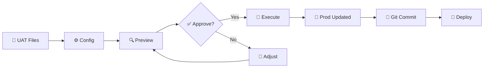

# 🚀 HelmEnvDelta

[](https://www.npmjs.com/package/helm-env-delta)
[](https://opensource.org/licenses/ISC)
[](https://nodejs.org/)

**Sync YAML configs across environments in seconds, not hours.**

Stop copying files manually. Stop worrying about accidental overwrites. Stop production incidents from configuration drift.

HelmEnvDelta (`hed`) automates environment synchronization for GitOps workflows while protecting your production-specific settings and preventing dangerous changes.

---

## 💡 Why Teams Love HelmEnvDelta

**Before:**

- ⏰ 30+ minutes manually copying files between UAT → Prod
- 😰 Accidentally overwrite production namespaces and replica counts
- 🐛 Major version upgrades slip through to production
- 📝 Inconsistent YAML formatting across environments
- 🔍 Noisy git diffs make code review painful

**After:**

- ⚡ 1 minute automated sync with safety guarantees
- 🛡️ Production-specific values automatically preserved
- 🚦 Stop rules block dangerous changes before deployment
- ✨ Consistent formatting across all environments
- 📊 Clean, structural diffs that show what actually changed

---

## ✨ Key Features

🔍 **Smart YAML Diff** - Compares structure, not text. Ignores formatting, comments, and array reordering to show only meaningful changes.

🎯 **Path Filtering** - Preserve environment-specific values (namespaces, replicas, secrets) that should never sync.

🔄 **Powerful Transforms** - Regex find/replace for both file content and paths. Change `uat-db.internal` → `prod-db.internal` automatically.

🛡️ **Safety Rules** - Block major version upgrades, scaling violations, and forbidden patterns before they reach production.

🎨 **Format Enforcement** - Standardize YAML across all environments: key ordering, indentation, quoting, array sorting.

📦 **Config Inheritance** - Reuse base configurations with environment-specific overrides.

📊 **Multiple Reports** - Console, HTML (visual), and JSON (CI/CD) output formats.

🔍 **Discovery Tools** - Preview files (`--list-files`), inspect config (`--show-config`), validate with warnings.

🛡️ **Safety First** - Pre-execution summary, first-run tips, improved error messages with helpful examples.

⚡ **High Performance** - 45-60% faster than alternatives with intelligent caching and parallel processing.

🔔 **Auto Updates** - Notifies when newer versions are available (skips in CI/CD).

---

## 📥 Installation

```bash
npm install -g helm-env-delta
```

**Requirements:** Node.js ≥ 22, npm ≥ 9

---

## 🎯 Quick Start

### 1️⃣ Create Config

```yaml
# config.yaml
source: './uat'
destination: './prod'

skipPath:
  '**/*.yaml':
    - 'metadata.namespace' # Never overwrite prod namespace
    - 'spec.replicas' # Keep prod scaling

transforms:
  '**/*.yaml':
    content:
      - find: "-uat\\b"
        replace: '-prod'
```

### 2️⃣ Preview Changes

```bash
helm-env-delta --config config.yaml --dry-run --diff
```

### 3️⃣ Execute Sync

```bash
helm-env-delta --config config.yaml
```

### 4️⃣ Review in Browser

```bash
helm-env-delta --config config.yaml --diff-html
```

**Done!** All files synced, production values preserved, changes validated.

---

## 🎬 Real-World Use Cases

### 🏢 Multi-Service GitOps

**Challenge:** 20+ microservices across Dev → UAT → Prod. Each has environment-specific namespaces, resource limits, and URLs.

**Solution:**

```yaml
source: './helm/uat'
destination: './helm/prod'

skipPath:
  '**/*.yaml':
    - 'metadata.namespace'
    - 'resources.limits'
    - 'spec.replicas'

transforms:
  '**/*.yaml':
    content:
      - find: '-uat\\b'
        replace: '-prod'
```

**Result:** Sync 50+ files in 5 seconds with zero risk of overwriting production settings.

---

### 🚨 Prevent Production Incidents

**Challenge:** Production incidents from accidental major version upgrades or scaling beyond cluster capacity.

**Solution:**

```yaml
stopRules:
  'services/**/values.yaml':
    - type: 'semverMajorUpgrade' # Block v1.x → v2.x
      path: 'image.tag'
    - type: 'numeric' # Enforce limits
      path: 'replicaCount'
      min: 2
      max: 10
```

**Result:** Dangerous changes blocked automatically. Use `--force` only when you intend it.

---

### 📐 Standardize Formatting

**Challenge:** Different editors, different formatting. Git diffs full of noise.

**Solution:**

```yaml
outputFormat:
  indent: 2
  keySeparator: true
  keyOrders:
    '**/*.yaml':
      - 'apiVersion'
      - 'kind'
      - 'metadata'
      - 'spec'
  arraySort:
    '**/*.yaml':
      - path: 'env'
        sortBy: 'name'
        order: 'asc'
```

**Result:** Every file formatted consistently. Clean diffs. Easier reviews.

---

## 🎓 Live Examples

The repository includes ready-to-run examples:

### 📁 Example 1: Config Inheritance

Shows how to reuse base configuration across multiple environment pairs.

```bash
helm-env-delta --config example/1-config-inheritance/config.uat-to-prod.yaml --dry-run --diff
```

### 🚦 Example 2: Stop Rules

Demonstrates all 5 stop rule types and how violations block execution.

```bash
helm-env-delta --config example/2-stop-rules/config.yaml --dry-run --diff
```

### ⛓️ Example 3: Multi-Environment Chain

Progressive promotion through Dev → UAT → Prod with cumulative transforms.

```bash
cd example/3-multi-env-chain
./sync-all.sh
```

### 🗑️ Example 4: Prune Mode

File deletion behavior with `prune: true` vs `prune: false`.

```bash
helm-env-delta --config example/4-prune-mode/config.with-prune.yaml --dry-run --diff
```

---

## ⚙️ Configuration Reference

### 🎯 Core Settings

```yaml
source: './uat' # Required: Source folder
destination: './prod' # Required: Destination folder

include: # Optional: File patterns (default: all)
  - '**/*.yaml'
exclude: # Optional: Exclude patterns
  - '**/test*.yaml'

prune: false # Optional: Delete dest files not in source
```

---

### 🔒 Path Filtering (skipPath)

Preserve environment-specific fields during sync.

```yaml
skipPath:
  'apps/*.yaml':
    - 'metadata.namespace' # Top-level field
    - 'spec.destination.namespace' # Nested field
    - 'spec.ignoreDifferences[*].jsonPointers' # Array wildcard

  'services/**/values.yaml':
    - 'microservice.env[*].value' # All array items
    - 'resources.limits'
```

**Use cases:** Namespaces, replicas, resource limits, secrets, URLs.

---

### 🔄 Transformations

Regex find/replace for content and file paths.

```yaml
transforms:
  'services/**/values.yaml':
    content: # Transform YAML values (not keys)
      - find: "uat-db\\.(.+)\\.internal"
        replace: 'prod-db.$1.internal' # Capture group $1

  'config/**/*.yaml':
    filename: # Transform file paths
      - find: 'envs/uat/'
        replace: 'envs/prod/'
      - find: '-uat\.'
        replace: '-prod.'
```

**Content scope:** All string values in matched files
**Filename scope:** Full relative path (folders + filename)
**Processing:** Sequential (rule 1 output → rule 2 input)

---

### 🛡️ Stop Rules

Block dangerous changes before deployment.

| Icon | Rule Type            | Purpose                   | Example                                    |
| ---- | -------------------- | ------------------------- | ------------------------------------------ |
| 🚫   | `semverMajorUpgrade` | Block major version bumps | Prevent `v1.2.3` → `v2.0.0`                |
| ⬇️   | `semverDowngrade`    | Block any downgrades      | Prevent `v1.3.0` → `v1.2.0`                |
| 📏   | `versionFormat`      | Enforce strict format     | Reject `1.2`, `v1.2.3-rc`, require `1.2.3` |
| 🔢   | `numeric`            | Validate ranges           | Keep `replicas` between 2-10               |
| 🔤   | `regex`              | Block patterns            | Reject `v0.x` pre-release versions         |

```yaml
stopRules:
  'services/**/values.yaml':
    - type: 'semverMajorUpgrade'
      path: 'image.tag'

    - type: 'numeric'
      path: 'replicaCount'
      min: 2
      max: 10

    - type: 'versionFormat'
      path: 'image.tag'
      vPrefix: 'required' # or 'forbidden', 'allowed'

    - type: 'regex'
      path: 'image.tag'
      regex: '^v0\.'
```

**Override:** Use `--force` to bypass stop rules when needed.

---

### 🎨 Output Formatting

Standardize YAML across all environments.

```yaml
outputFormat:
  indent: 2 # Indentation size
  keySeparator: true # Blank line between top-level keys

  keyOrders: # Custom key ordering
    'apps/*.yaml':
      - 'apiVersion'
      - 'kind'
      - 'metadata'
      - 'spec'

  arraySort: # Sort arrays
    'services/**/values.yaml':
      - path: 'env'
        sortBy: 'name'
        order: 'asc'

  quoteValues: # Force quoting
    'services/**/values.yaml':
      - 'env[*].value'
```

**Benefits:** Consistent formatting, cleaner diffs, better readability.

---

### 🔗 Config Inheritance

Reuse base configurations across environment pairs.

**Base config (`base.yaml`):**

```yaml
include: ['**/*.yaml']
prune: true

skipPath:
  'apps/*.yaml':
    - 'spec.destination.namespace'

outputFormat:
  indent: 2
  keySeparator: true
```

**Environment config (`prod.yaml`):**

```yaml
extends: './base.yaml' # Inherit base settings

source: './uat'
destination: './prod'

transforms: # Add environment-specific transforms
  '**/*.yaml':
    content:
      - find: '-uat\\b'
        replace: '-prod'

stopRules: # Add production safety rules
  'services/**/values.yaml':
    - type: 'semverMajorUpgrade'
      path: 'image.tag'
```

**Merging:**

- Arrays: Concatenated (child adds to parent)
- Objects: Deep merged (child overrides parent)
- Max depth: 5 levels

---

## 🖥️ CLI Reference

### Commands

```bash
helm-env-delta --config <file> [options]
hed --config <file> [options]  # Short alias
```

### Options

| Flag              | Description                                      |
| ----------------- | ------------------------------------------------ |
| `--config <path>` | **Required** - Configuration file                |
| `--validate`      | Validate config and exit (shows warnings)        |
| `--dry-run`       | Preview changes without writing files            |
| `--force`         | Override stop rules                              |
| `--diff`          | Show console diff                                |
| `--diff-html`     | Generate HTML report (opens in browser)          |
| `--diff-json`     | Output JSON to stdout (pipe to jq)               |
| `--list-files`    | List source/destination files without processing |
| `--show-config`   | Display resolved config after inheritance        |
| `--skip-format`   | Skip YAML formatting                             |
| `--no-color`      | Disable colored output (CI/accessibility)        |
| `--verbose`       | Show detailed debug info                         |
| `--quiet`         | Suppress output except errors                    |

### Examples

```bash
# Validate configuration (shows warnings)
hed --config config.yaml --validate

# Preview files that will be synced
hed --config config.yaml --list-files

# Display resolved config (after inheritance)
hed --config config.yaml --show-config

# Preview with diff
hed --config config.yaml --dry-run --diff

# Visual HTML report
hed --config config.yaml --diff-html

# CI/CD integration (no colors)
hed --config config.yaml --diff-json --no-color | jq '.summary'

# Execute sync
hed --config config.yaml

# Force override stop rules
hed --config config.yaml --force
```

---

## 🔄 Typical Workflow



**Step-by-step:**

```bash
# 1. Preview changes
hed --config config.yaml --dry-run --diff

# 2. Review in browser
hed --config config.yaml --diff-html

# 3. Execute sync
hed --config config.yaml

# 4. Git workflow
git add prod/
git commit -m "Sync UAT to Prod"
git push origin main
```

---

## 🏆 Why Choose HelmEnvDelta?

### 🆚 Compared to Alternatives

**HelmEnvDelta** is purpose-built for environment synchronization, not template generation or deployment.

| What You Get              | vs Helmfile   | vs Kustomize | vs Bash Scripts |
| ------------------------- | ------------- | ------------ | --------------- |
| 🔍 Structural YAML diff   | ✅ Yes        | ❌ No        | ❌ No           |
| 🎯 Environment-aware sync | ✅ Yes        | ⚠️ Manual    | ⚠️ Custom       |
| 🛡️ Safety validation      | ✅ Built-in   | ❌ None      | ⚠️ DIY          |
| 🔄 Smart merge            | ✅ Deep merge | ⚠️ Limited   | ⚠️ DIY          |
| 🎨 Format enforcement     | ✅ Yes        | ❌ No        | ❌ No           |
| 📚 Learning curve         | 🟢 Low        | 🟡 Medium    | 🔴 High         |

**Complementary:** Use HelmEnvDelta alongside Helm, Helmfile, Kustomize, ArgoCD, or Flux.

---

### 💪 Benefits

✅ **Safety** - Stop rules prevent dangerous changes. Dry-run previews everything.

✅ **Speed** - 30 minutes → 1 minute sync time. Parallel processing.

✅ **Consistency** - Uniform YAML formatting. No more diff noise.

✅ **Auditability** - Field-level change tracking with JSONPath. Clean structural diffs.

✅ **Flexibility** - Per-file patterns. Config inheritance. Regex transforms.

✅ **Reliability** - 787 tests, 84% coverage. Battle-tested.

---

## 📊 JSON Output for CI/CD

```bash
hed --config config.yaml --diff-json > report.json
```

**Schema:**

```json
{
  "metadata": {
    "timestamp": "2025-12-27T10:30:00Z",
    "source": "./uat",
    "destination": "./prod",
    "dryRun": true
  },
  "summary": {
    "added": 2,
    "changed": 3,
    "deleted": 1,
    "unchanged": 15
  },
  "files": {
    "changed": [
      {
        "path": "prod/app.yaml",
        "changes": [
          {
            "path": "$.image.tag",
            "oldValue": "v1.2.3",
            "updatedValue": "v1.3.0"
          }
        ]
      }
    ]
  },
  "stopRuleViolations": [
    {
      "file": "prod/app.yaml",
      "rule": { "type": "semverMajorUpgrade" },
      "message": "Major upgrade: v1.2.3 → v2.0.0"
    }
  ]
}
```

**Use with jq:**

```bash
# Summary
jq '.summary' report.json

# Violations
jq '.stopRuleViolations' report.json

# Changed files
jq '.files.changed[].path' report.json
```

---

## 🔧 Advanced Features

### 🧠 Structural Comparison

Git diffs are noisy when arrays are reordered. HelmEnvDelta compares YAML structure and recognizes identical content regardless of order.

**Example:**

```yaml
# Source
env:
  - name: DB_URL
    value: uat-db
  - name: LOG_LEVEL
    value: debug

# Destination
env:
  - name: LOG_LEVEL
    value: info
  - name: DB_URL
    value: prod-db
```

**Git diff:** Shows all lines changed (noisy)
**HelmEnvDelta:** Only `LOG_LEVEL: debug → info` (clean)

---

### 🔀 Deep Merge

Preserves destination values for skipped paths.

```yaml
# Source (UAT)
metadata:
  namespace: uat
spec:
  replicas: 3

# Config
skipPath:
  "*.yaml":
    - "metadata.namespace"
    - "spec.replicas"

# Destination (Prod) - preserved after sync!
metadata:
  namespace: prod  # ← Kept
spec:
  replicas: 5      # ← Kept
```

---

## 🆘 Common Issues

### ❓ Stop rule violations blocking sync

**Error:** `🛑 Stop Rule Violation (semverMajorUpgrade)`

**Fix:** Review change carefully. Use `--force` if intentional.

---

### ❓ Transforms not applying

**Check:**

- File pattern: `**/*.yaml` vs `*.yaml`
- Regex escaping: `\\.` for literal dots
- Word boundaries: `\\b`

---

### ❓ JSONPath syntax errors

```yaml
# ❌ Wrong
- '$.spec.replicas' # Don't use $. prefix
- 'env.*.name' # Use [*] not .*

# ✅ Correct
- 'spec.replicas' # No prefix
- 'env[*].name' # Array wildcard
```

---

### ❓ Glob patterns not matching

| Pattern          | Matches                 |
| ---------------- | ----------------------- |
| `*.yaml`         | Current directory only  |
| `**/*.yaml`      | Recursive (all subdirs) |
| `apps/*.yaml`    | One level deep          |
| `apps/**/*.yaml` | Recursive under apps/   |

---

## 📚 Resources

📦 **npm:** [helm-env-delta](https://www.npmjs.com/package/helm-env-delta)

🐙 **GitHub:** [BCsabaEngine/helm-env-delta](https://github.com/BCsabaEngine/helm-env-delta)

🐛 **Issues:** [GitHub Issues](https://github.com/BCsabaEngine/helm-env-delta/issues)

📄 **License:** [ISC](https://opensource.org/licenses/ISC)

---

## 🎉 Success Stories

**Typical adoption timeline:**

- **Week 1:** Install, create basic config, dry-run on one service
- **Week 2:** Expand to 5 services, add skipPath rules
- **Week 3:** Add stop rules (catch first bug!)
- **Week 4:** Standardize YAML formatting
- **Month 2:** Full adoption for all services

**Results:**

- ⏱️ Sync time: **2 hours/week → 10 minutes/week**
- 🐛 Production incidents from sync errors: **Zero**
- 😊 Team satisfaction: **High**

---

**Built for DevOps and Platform teams managing multi-environment Kubernetes and Helm deployments.**

**Made with ❤️ by BCsabaEngine**
